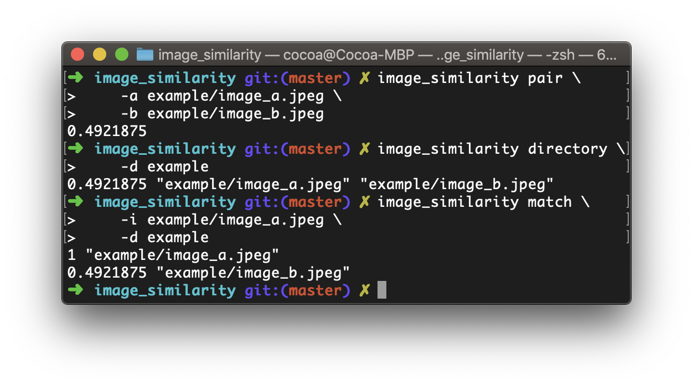

# image_similarity
Compute Image Similarity in Rust with OpenCV

## Compile
```bash
cargo build --release
```

## screenshot


## Usage
### Compare two images

```bash
image_similarity pair \
    -a image_a.png \
    -b image_b.jpg
```

### Compare all images in given directory 

with default allowed extension, `png`, `jpg` and `jpeg`

```bash
image_similarity directory \
    -d /PATH/TO/A/DIRECTORY
```

to customize allowed extension
```bash
image_similarity directory \
    -d /PATH/TO/A/DIRECTORY \
    -e png,jpg,webp
```

### Compare given image with all images that end in allowed extensions in a directory 

with default allowed extension, `png`, `jpg` and `jpeg`

```bash
image_similarity match \
    -i image.png \
    -d /PATH/TO/A/DIRECTORY
```

to customize allowed extension
```bash
image_similarity match \
    -i image.png \
    -d /PATH/TO/A/DIRECTORY \
    -e png,jpg,webp
```
